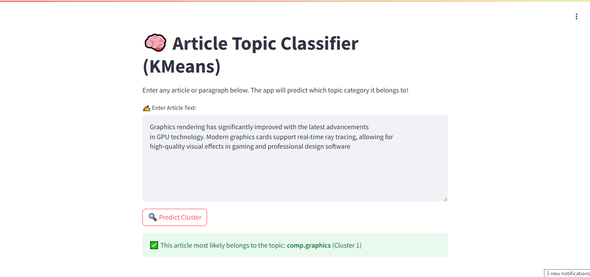

# Text Clustering Project

## 📌 Overview
This project focuses on **unsupervised text clustering** using **machine learning techniques**. It involves preprocessing text data, extracting meaningful features, reducing dimensionality, and applying various clustering algorithms. A simple **Streamlit web app** is also built to classify new text inputs based on trained models.

## 🛠️ Key Features
- **Preprocessing**: Uses `NLTK` for text cleaning, including:
  - Lowercasing
  - Removing special characters
  - Removing **stop words**
  - Applying **stemming**
- **Feature Extraction**: Converts text into numerical form using **TF-IDF (Term Frequency-Inverse Document Frequency)**.
- **Dimensionality Reduction**: Reduces feature space using:
  - **PCA (Principal Component Analysis)**
  - **t-SNE (t-Distributed Stochastic Neighbor Embedding)** for visualization.
- **Clustering Algorithms**: Implements and compares:
  - **K-Means Clustering**
  - **Gaussian Mixture Model (GMM)**
  - **Agglomerative Clustering**
- **Visualization**: Uses **Matplotlib & Seaborn** to visualize high-dimensional text data.
- **Streamlit App**: A web-based app allows users to input text and predict its cluster.

## 📂 Dataset
The dataset used for clustering can be accessed at the following links:
- [[Dataset Link 1](#https://www.kaggle.com/datasets/crawford/20-newsgroups/code)
- [Dataset Link 2](#https://www.kaggle.com/datasets/sameersmahajan/people-wikipedia-data) 

## 🖼️ Application Screenshot
 

## 🔧 Installation & Usage
1. **Clone the repository:**
   ```bash
   git clone https://github.com/your-repo/text-clustering.git
   cd text-clustering
   ```
2. **Install dependencies:**
   ```bash
   pip install -r requirements.txt
   ```
3. **Run the Streamlit app:**
   ```bash
   streamlit run app.py
   ```


